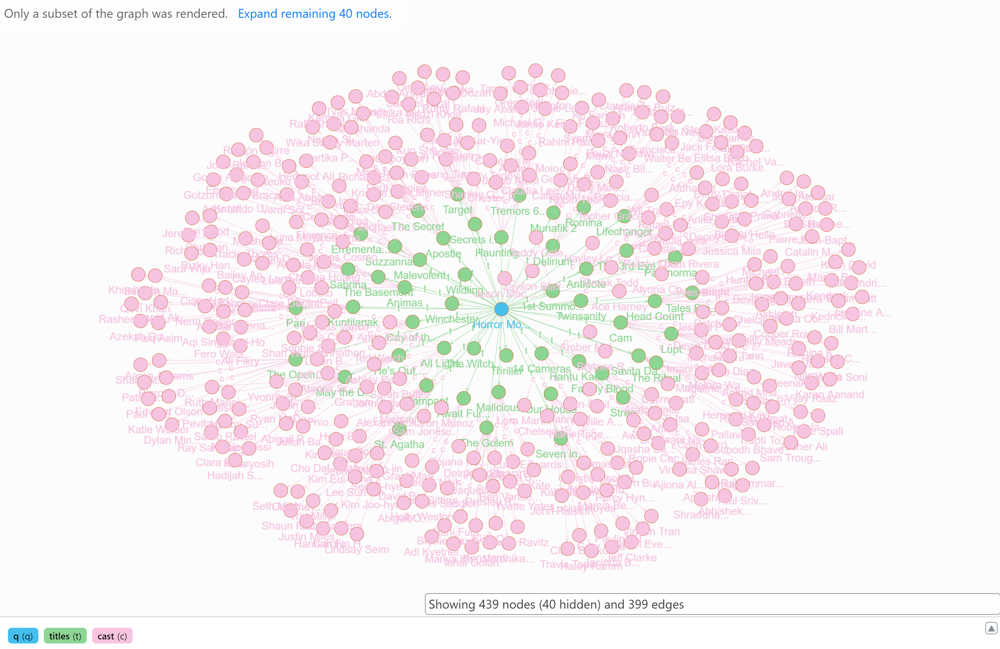

## Setup

*This dataset requires access to [Kaggle](https://www.kaggle.com/docs/api)*.

From the `samples/netflix` folder.

```sh
cd input

sh download_data.sh
python download_cleanup.py

cd ..

# Applies to DGraph
sh publish.sh
```

This will apply data to your local DGraph instance. Then you can try an example queries below.

## Example Queries

### Query 1: Find all Actors related to Horror Movies in 2018

```sh
{
  q(func: type(genre)) @filter(eq(identifier, "Horror Movies"))
    {
  		name: identifier
  		titles: ~genre @filter(type(title) AND eq(release_year, 2018)) {
        name: title
        description
        cast {
          name: identifier
        }
      }
	}
}
```



### Query 2: Find all the Movies that Robert Downey Jr is in and the associated Rating

```sh
{
  q(func: type(cast)) @filter(eq(identifier, "Robert Downey Jr."))
    {
      name: identifier
      titles: ~cast @filter(type(title)) @normalize {
        name: title
        rating {
          rating: identifier
        }
      }
	}
}
```

### Query 3: Find all the Titles that both Mike Myers and Seth Green are appear in

```sh
{
   mike as var(func: type(cast)) @filter(eq(identifier, "Mike Myers")) { uid }
   seth as var(func: type(cast)) @filter(eq(identifier, "Seth Green")) { uid }

	title(func: type(title), orderdesc: release_year)
     @filter(uid_in(cast, uid(mike)) AND uid_in(cast, uid(seth)))
   {
        name: title
        description
        release_year
   }
}
```

### Query 4: Find all Titles where the term 'Autobots' appears in the description

```sh
{
  q(func: type(title)) @filter(anyofterms(description, "Autobots"))
	{
      identifier
    	name: title
    	description
    }
}
```

### Query 5: Find the total counts of titles per Genre

```sh
{
  var(func: type(title)) @groupby(genre)
  {
  	c as count(uid)
  }

  genre_counts(func: uid(c), orderdesc: val(c))
  {
    name: identifier # from the genre node (grouped)
    count: val(c)
  }
}
```