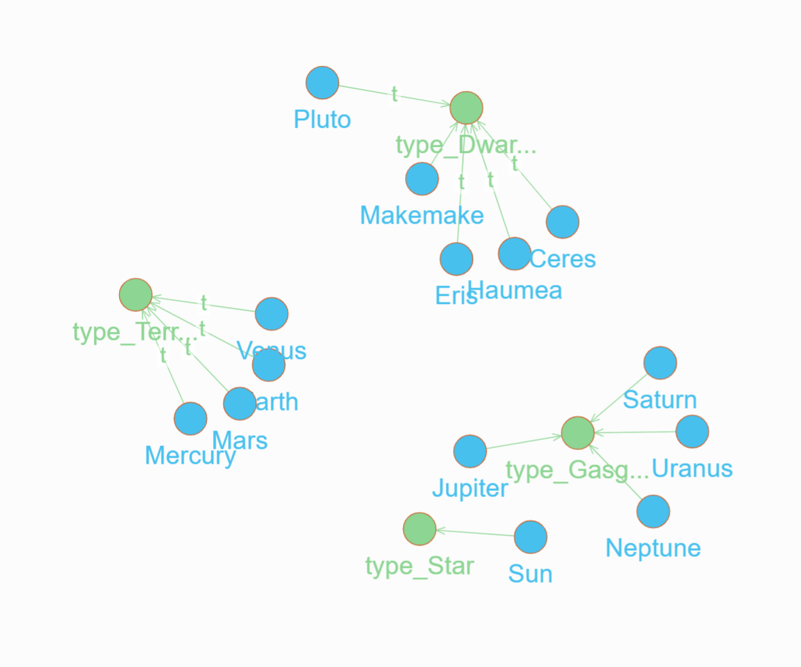

# Planets Sample

[Data Source](https://github.com/sachans/Planet-connaissance/blob/master/Solar%20System.csv)


Ensure you are in the `samples/planets` directory and have DGraph running locally and then run `sh publish.sh`.

This will:
- Generate a Schema
- Generate Upsert Exports
- Apply them to DGraph

You can then query via Ratel:

```js
{
  q(func: type(planet))
    {
     name
     orbital_period_years
     inclination_axis_degrees
     dgraph.type
    	type {
        name: xid
    	}
    }
}
```

And should get back a result like this:


